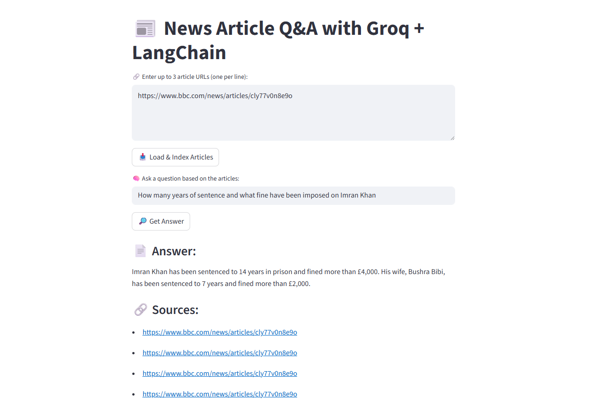

# 📰 News Generator Application using LLMs (Groq + LangChain + Streamlit)

 <!-- Replace with your actual screenshot path -->

[](https://news-generator-application-llm.streamlit.app/) <!-- Replace with your Streamlit app URL -->
---

## 🔍 Overview

**News Generator Application** is a powerful web app built using **Groq LLMs**, **LangChain**, and **Streamlit**. It allows users to:
- Load news articles from URLs
- Process and embed article content
- Ask natural language questions
- Get answers powered by **LLaMA-4** models from **Groq API**

The app uses **UnstructuredURLLoader** and **FAISS vector store** to allow semantic search and question answering on any articles provided.

---

## ✨ Features

- 🔗 Accepts multiple article URLs (up to 3 at a time)
- ✂️ Splits and embeds text using `HuggingFace Embeddings`
- 📚 Stores processed data in `FAISS` vector index
- 💬 Answers your questions using Groq’s LLMs
- 📄 Cites article sources used in answering
- 🚀 Easy to use UI via Streamlit

---

## 📦 Technologies Used

- [LangChain](https://python.langchain.com/)
- [Groq API](https://console.groq.com/)
- [Streamlit](https://streamlit.io/)
- [HuggingFace Transformers](https://huggingface.co/)
- [FAISS](https://github.com/facebookresearch/faiss)

---

## ⚙️ Local Setup

### 1. Clone the repository
```bash
git clone https://github.com/yourusername/News-Generator-Application-LLM.git
cd News-Generator-Application-LLM
```

### 2. Create a virtual environment and activate it
```bash
python -m venv venv
venv\Scripts\activate   # On Windows
# or
source venv/bin/activate  # On Mac/Linux
```

### 3. Install dependencies
```bash
pip install -r requirements.txt
```

### 4. Add your Groq API key
Create a `.env` file and add the following:
```env
GROQ_API_KEY=your_real_groq_api_key
```

### 5. Run the app locally
```bash
streamlit run main.py
```

---

## ☁️ Streamlit Deployment

If deploying on **Streamlit Cloud**, follow these steps:

### 1. Push your code to GitHub
Make sure `.env` and `vector_index.pkl` are excluded using `.gitignore`.

### 2. Add your Groq API Key in Streamlit Secrets
Go to the app's dashboard → **⋮ > Edit Secrets** and paste:
```toml
GROQ_API_KEY = "your_real_groq_api_key"
```

### 3. Deploy the app
Click **Deploy** and Streamlit will build and run your app online.

---

## 🧠 How It Works

1. Loads articles from URLs using `UnstructuredURLLoader`
2. Splits and embeds using `RecursiveCharacterTextSplitter` + HuggingFace
3. Saves and queries vector index via `FAISS`
4. Sends the context to **Groq's LLaMA-4** for answering user questions
5. Displays answer with referenced sources

---

## 📸 Screenshot

Place your screenshot at `./assets/app_screenshot.png` or update the image path accordingly in this README.

---

## 🛡️ License

Apache-2.0

---

## 🙌 Acknowledgments

Thanks to:
- [Groq](https://groq.com/) for lightning-fast inference API
- [LangChain](https://www.langchain.com/) for the QA framework
- [Streamlit](https://streamlit.io/) for easy deployment and UI


